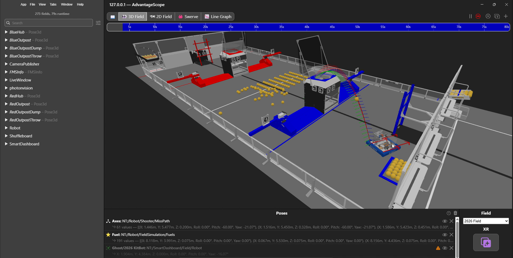

# 9043 Simulation – YAGSL + Maple + PhotonVision 🚀

Bu repo, **FRC Team 9043** için hazırlanmış bir **robot simülasyonu** projesidir.  
Simülasyon, **AdvantageScope** ile uyumlu olacak şekilde çalışır.

## 🔧 İçerik
- **YAGSL** (Yet Another Generic Swerve Library)  
- **MapleSim** tabanlı sürüş simülasyonu  
- **PhotonVision** ile kamera & hedef simülasyonu  
- WPILib sim ortamı

## 🎯 Amaç
Gerçek robota geçmeden önce:
- Swerve sürüşü test etmek  
- Odometry & pose takibini görmek  
- PhotonVision verilerini AdvantageScope üzerinden analiz etmek  

hepsi **tamamen sim ortamında** 🧠💻

## 📊 AdvantageScope
- Field2d
- Robot pose
- Swerve modülleri
- Vision ölçümleri  

sorunsuz şekilde izlenebilir.

## 🧪 Not
Bu proje **simülasyon odaklıdır**, gerçek robot kodu değildir.  
Test, debug ve geliştirme amaçlı kullanılır.

---

